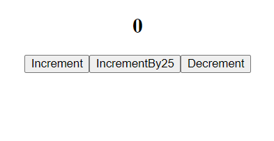

# React Redux Counter Demo

This is a simple demo application that demonstrates the use of **React** and **Redux**. It includes three buttons to interact with a counter value:
- **Increment**: Increases the counter by 1.
- **Decrement**: Decreases the counter by 1.
- **Increment by 25**: Increases the counter by 25.

## Features

- **React** for building the user interface.
- **Redux** for managing the application state.
- Basic counter functionality using Redux actions and reducers.

## Preview

Here's a quick look at what this app can do:



## Getting Started

### Prerequisites

- **Node.js** (>= 14.x) and **npm** (or **yarn**) should be installed on your machine.

### Installation

1. **Clone the Repository**

   ```bash
   git clone https://github.com/yourusername/react-redux-counter-demo.git
   cd react-redux-counter-demo

2. **Install Dependencies**
   Using npm:
   ```bash
   npm install 
   ```

   Or, using yarn:
   ```bash
   yarn install
   ```

### Running the App
To run the application locally, use the following command:
```bash
npm start
```
Or, with yarn:
```bash
yarn start
```
This will start the app on http://localhost:3000 by default.

### Building the App
To build the app for production, run:
```bash
npm run build
```
The production build will be stored in the build directory.

### Usage
Once the app is running, you will see a counter displayed with three buttons:
1.Increment: Adds 1 to the counter.
2.Decrement: Subtracts 1 from the counter.
3.Increment by 25: Adds 25 to the counter.
The app uses Redux to manage the counter state. Actions are dispatched when the buttons are clicked, and the state is updated accordingly.


